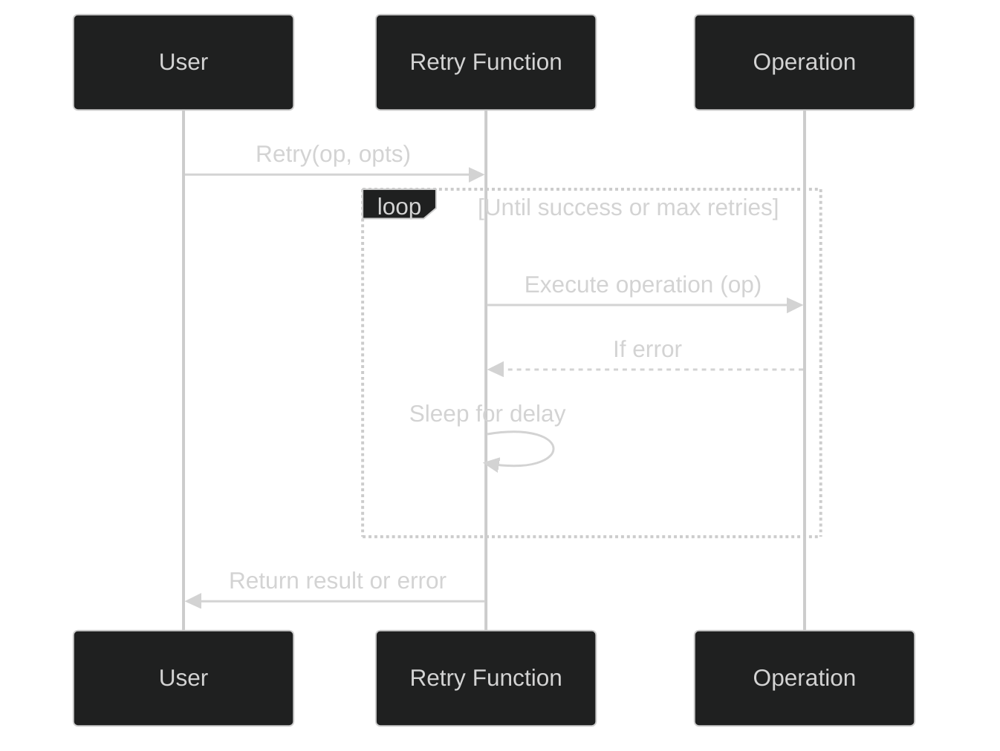

[](https://pkg.go.dev/github.com/hoshiimo-se/retry)
[](https://github.com/hoshiimo-se/retry/blob/master/license)
[](https://github.com/hoshiimo-se/retry)
[](https://twitter.com/hoshiimo_se)

# retry
Retries using the exponential backoff algorithm can be easily realized.



# Usage
```go
op := func() (interface{}, error) {
  fmt.Printf("some form of processing...（%v）\n", time.Now())
  return nil, errors.New("Error!!")
}
result, err := retry.Retry(op)
```

# License
MIT

# Author
hoshiimo
