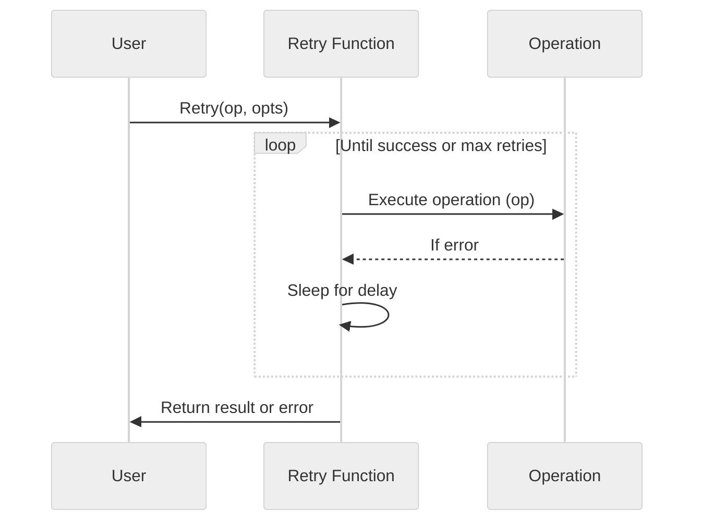

[](https://pkg.go.dev/github.com/hoshiimo-se/retry)
[](https://github.com/hoshiimo-se/retry/blob/master/license)
[](https://github.com/hoshiimo-se/retry)
[](https://twitter.com/hoshiimo_se)

# retry
Retries using the exponential backoff algorithm can be easily realized.



# Usage
## No return value
```go
op := func() error {
    return errors.New("Error!!")
}

err := retry.Retry(op, retry.WithInitialDelay(2*time.Second), retry.WithMaxRetries(3))
```

## One return value
```go
op := func() (string, error) {
    return "", errors.New("Error!!")
}

result, err := retry.RetryOneResult(op, retry.WithInitialDelay(2*time.Second), retry.WithMaxRetries(3))
```

## Two return values
```go
	op := func() (string, bool, error) {
		return "", false, errors.New("Error!!")
	}

	result1, result2, err := retry.RetryTwoResult(op, retry.WithInitialDelay(2*time.Second), retry.WithMaxRetries(3))
```

# License
MIT

# Author
hoshiimo
